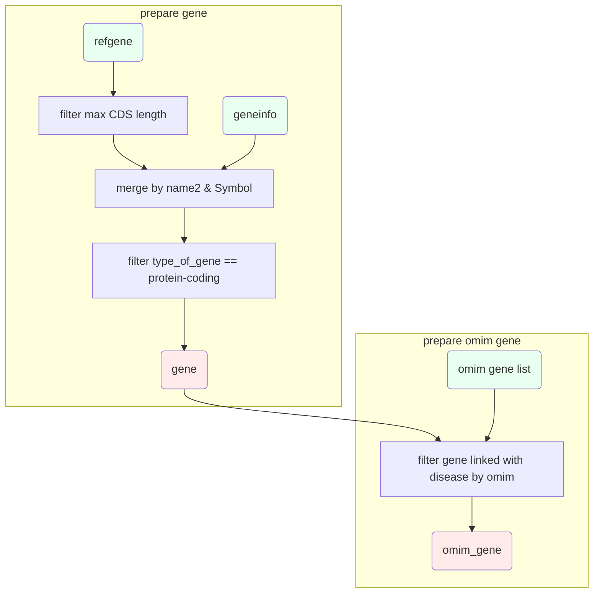
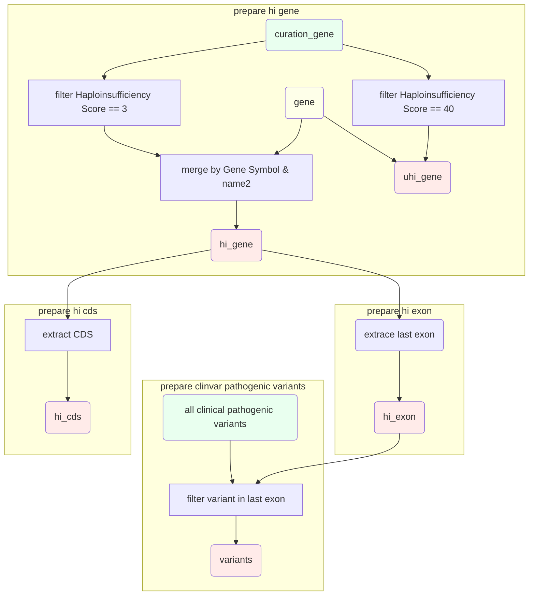
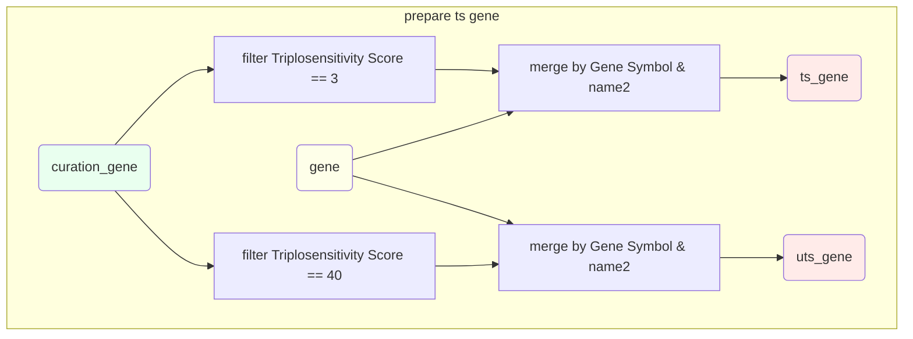
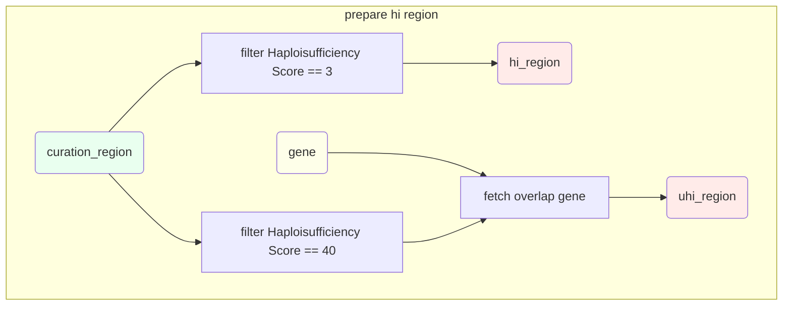
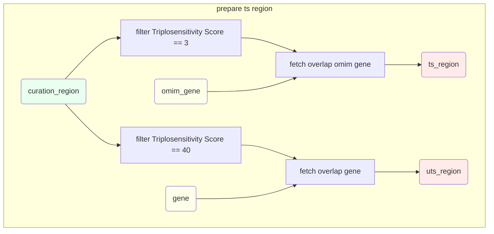
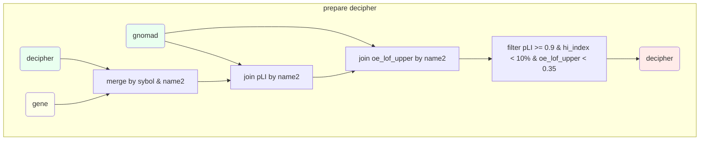

# ACIT数据库生成流程

## 基因 (Gene)

```mermaid
graph TD
	
	classDef input fill:#e9ffef
	
	classDef output fill:#ffebe9
	
	classDef variable fill:#feffe9

	subgraph prepare gene
        refgene("refgene")
        class refgene input

        filter_length["filter max CDS length"]
        refgene --> filter_length

        geneinfo("geneinfo")
        class geneinfo input
		
        merge["merge by name2 & Symbol"]
        filter_length --> merge
        geneinfo --> merge

        filter_protein["filter type_of_gene == protein-coding"]
        merge --> filter_protein

        gene("gene")
        class gene output
        filter_protein --> gene
	end
	
	subgraph prepare omim gene
		omim_gene_list("omim gene list")
		class omim_gene_list input
		
		filter_omim["filter gene linked with disease by omim"]
		gene --> filter_omim
		omim_gene_list --> filter_omim
		
		omim_gene("omim_gene")
		class omim_gene output
		filter_omim --> omim_gene
	end
```

## 单倍体敏感基因(HI Gene)

```mermaid
graph TD
	
	classDef input fill:#e9ffef
	
	classDef output fill:#ffebe9
	
	classDef variable fill:#feffe9
	
	subgraph prepare hi gene
		curation_gene("curation_gene")
		class curation_gene input
		
		gene("gene")
		class gene variable
		
		filter_hi["filter Haploinsufficiency Score == 3"]
		curation_gene --> filter_hi
		
		merge["merge by Gene Symbol & name2"]
		filter_hi --> merge
		gene --> merge
		
		hi_gene("hi_gene")
		class hi_gene output
		merge --> hi_gene
		
		
		filter_uhi["filter Haploinsufficiency Score == 40"]
		curation_gene --> filter_uhi
		
		uhi_gene("uhi_gene")
		class uhi_gene output
		gene --> uhi_gene
		filter_uhi --> uhi_gene
	end

	subgraph prepare hi exon
		exon("extrace last exon")
		hi_gene --> exon
		
		hi_exon("hi_exon")
		class hi_exon output
		exon --> hi_exon
	end

	subgraph prepare clinvar pathogenic variants
		all_variants("all clinical pathogenic variants")
		class all_variants input
		
		exon_variants["filter variant in last exon"]
		all_variants --> exon_variants
		hi_exon --> exon_variants
		
		pathogenic_exon_variants("variants")
		class pathogenic_exon_variants output
		exon_variants --> pathogenic_exon_variants
	end
	
	subgraph prepare hi cds
		cds["extract CDS"]
		hi_gene --> cds
		
		hi_cds("hi_cds")
		class hi_cds output
		cds --> hi_cds
	end
	
```

## 多倍体敏感基因 (TS Gene)

```mermaid
graph TD
	
	classDef input fill:#e9ffef
	
	classDef output fill:#ffebe9
	
	classDef variable fill:#feffe9
	
	subgraph prepare ts gene
		curation_gene("curation_gene")
		class curation_gene input
		
		gene("gene")
		class gene variable
		
		filter_ts["filter Triplosensitivity Score == 3"]
		curation_gene --> filter_ts
		
		merge_ts["merge by Gene Symbol & name2"]
		filter_ts --> merge_ts
		gene --> merge_ts
		
		ts_gene("ts_gene")
		class ts_gene output
		merge_ts --> ts_gene
		
		filter_uts["filter Triplosensitivity Score == 40"]
		curation_gene --> filter_uts
		
		merge_uts["merge by Gene Symbol & name2"]
		gene --> merge_uts
		filter_uts --> merge_uts
		
		uts_gene("uts_gene")
		class uts_gene output
		merge_uts --> uts_gene
	end
```

## 单倍体敏感区域 (HI region)

```mermaid
graph TD
	
	classDef input fill:#e9ffef
	
	classDef output fill:#ffebe9
	
	classDef variable fill:#feffe9
	
	subgraph prepare hi region
		curation("curation_region")
		class curation input
		
		filter_hi["filter Haploisufficiency Score == 3"]
		curation --> filter_hi
		
		hi_region("hi_region")
		class hi_region output
		filter_hi --> hi_region
		
		filter_uhi["filter Haploisufficiency Score == 40"]
		curation --> filter_uhi
		
		gene("gene")
		class gene variable
		
		fetch_gene["fetch overlap gene"]
		gene --> fetch_gene
		filter_uhi --> fetch_gene
		
		uhi_region("uhi_region")
		class uhi_region output
		fetch_gene --> uhi_region
	end
```

## 多倍体敏感区域 (TS region)

```mermaid
graph TD
	
	classDef input fill:#e9ffef
	
	classDef output fill:#ffebe9
	
	classDef variable fill:#feffe9
	
	subgraph prepare ts region
		curation("curation_region")
		class curation input
		
		filter_ts["filter Triplosensitivity Score == 3"]
		curation --> filter_ts
		
		omim_gene("omim_gene")
		class omim_gene variable
		
		fetch_omim_gene["fetch overlap omim gene"]
		filter_ts --> fetch_omim_gene
		omim_gene --> fetch_omim_gene
		
		ts_region("ts_region")
		class ts_region output
		fetch_omim_gene --> ts_region
		
		filter_uts["filter Triplosensitivity Score == 40"]
		curation --> filter_uts
		
		gene("gene")
		class gene variable
		
		fetch_gene["fetch overlap gene"]
		filter_uts --> fetch_gene
		gene --> fetch_gene
		
		uts_region("uts_region")
		class uts_region output
		fetch_gene --> uts_region
	end
```

## 预测基因 (decipher)

```mermaid
graph TD
	
	classDef input fill:#e9ffef
	
	classDef output fill:#ffebe9
	
	classDef variable fill:#feffe9
	
	subgraph prepare decipher
		predictions("decipher")
		class predictions input
		
		gene("gene")
		class gene variable
		
		merge["merge by sybol & name2"]
		predictions --> merge
		gene --> merge
		
		gnomad("gnomad")
		class gnomad input
		
		join_pli["join pLI by name2"]
		gnomad --> join_pli
		merge --> join_pli
		
		join_lof["join oe_lof_upper by name2"]
		gnomad --> join_lof
		join_pli --> join_lof
		
		filter["filter pLI >= 0.9 & hi_index < 10% & oe_lof_upper < 0.35"]
		join_lof --> filter
		
		decipher("decipher")
		class decipher output
		filter --> decipher
	end
```

## control

```mermaid
graph TD
	
	classDef input fill:#e9ffef
	
	classDef output fill:#ffebe9
	
	classDef variable fill:#feffe9
	
	subgraph prepare gnomad	
		
		gnomad("gnomad")
		class gnomad input
		
		filter_qc["filter FILTER == PASS & svtype in (DEL, DUP)"]
		gnomad --> filter_qc
		
		subgraph af filters
			filter_af["filter N_BI_GENOS >= 1000"]
			
			filter_afr["filter AFR_N_BI_GENOS >= 1000"]
			filter_af -. or .-> filter_afr
			
			filter_amr["filter AMR_N_BI_GENOS >= 1000"]
			filter_afr -. or .-> filter_amr
			
			filter_eas["filter EAS_N_BI_GENOS >= 1000"]
			filter_amr -. or .-> filter_eas
			
			filter_eur["filter EUR_N_BI_GENOS >= 1000"]
			filter_eas -. or .-> filter_eur
		end
		filter_qc --> filter_af
		
		fetch_gene_gnomad["fetch ovalap gene"]
		filter_eur --> fetch_gene_gnomad
		
		filter_del["filter svtype == DEL"]
		fetch_gene_gnomad --> filter_del
		
		gnomad_del("gnomad_del")
		class gnomad_del output
		filter_del --> gnomad_del
		
		filter_dup["filter svtype == DUP"]
		fetch_gene_gnomad --> filter_dup
		
		gnomad_dup("gnomad_dup")
		class gnomad_dup output
		filter_dup --> gnomad_dup
	end
	
	subgraph prepare dgv
		dgv("dgv")
		class dgv input
		
		filter_dgv["filter freq >= 1% & sample >= 1000"]
		dgv --> filter_dgv
		
		fetch_gene_dgv["fetch overlap gene"]
		filter_dgv --> fetch_gene_dgv
		
		filter_gain["filter type == Gain"]
		fetch_gene_dgv --> filter_gain
		
		dgv_gain("dgv_gain")
		class dgv_gain output
		filter_gain --> dgv_gain
		
		filter_loss["filter type == Loss"]
		fetch_gene_dgv --> filter_loss
		
		dgv_loss("dgv_loss")
		class dgv_loss output
		filter_loss --> dgv_loss
	end
```

